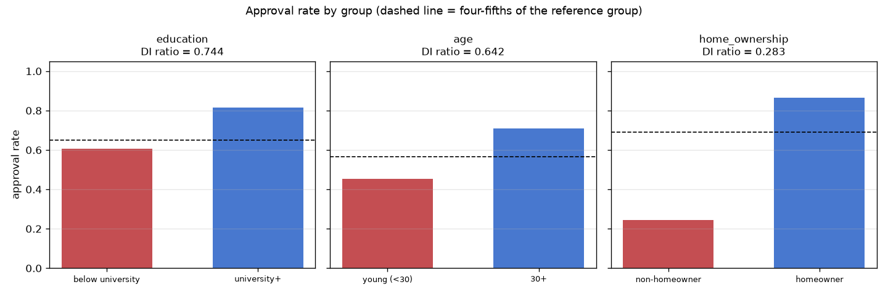
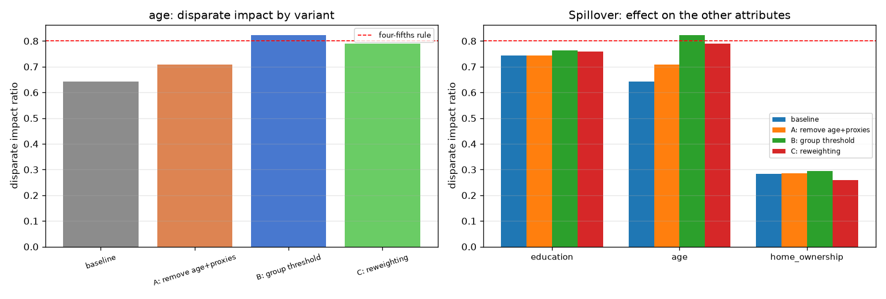

# Governance-Based Fairness Assessment

**System:** credit-risk approval classifier (TrustAI-X)
**Assessed by:** Osman Eren Doğan · TrustAI Internship, Task 2
**Evidence base:** Task 1 fairness audit and Task 3 mitigation experiments
**Data:** 100,000 synthetic applicants; 20,000 held out for evaluation

---

## 1. Management summary

A machine-learning model decides which credit applicants are approved. We tested whether it
treats different groups of people equally, and whether the unequal treatment we found can be
fixed.

**What we found.** The model does not pass the standard legal fairness test — the *four-fifths
rule*, which says a disadvantaged group should be approved at least 80 % as often as the
reference group. It fails this test for **all three** groups we examined. The worst case is
**home ownership**: applicants who do not own a home are approved at **28%**
of the rate of homeowners — roughly a third of the legal threshold.

**What we tried.** Three standard remedies were tested. One of them — adjusting the decision
threshold for the disadvantaged group — brings the **age** gap into compliance. It costs
approximately **170 additional approved defaulters per 20,000 applications**,
which is a direct credit loss.

**What we could not fix.** Neither education nor home ownership reaches compliance under any
remedy tested. Home ownership barely moves at all.

**Recommendation: NO-GO.** 2 of 3 attributes remain below the four-fifths threshold even under the best mitigation tested. The blocking issues are
**Education level, Home ownership**. Deploying the model as it stands would expose the organisation to adverse-impact
liability on groups that make up a large share of applicants.

---

## 2. Technical fairness summary

### Model under assessment

| Property | Value |
|---|---|
| Algorithm | LogisticRegression(class_weight='balanced') |
| Features | 11 |
| Training / test rows | 80,000 / 20,000 |
| Decision threshold | 0.5 |
| ROC AUC (held out) | **0.9136** |
| Overall approval rate | 66.2% |

The favourable outcome is **approval**, so all metrics are computed on approval rates. The model
is a competent risk predictor — this assessment is about *distribution* of its decisions, not
accuracy.

### Group base rates

Some of the approval gap reflects genuine differences in default behaviour. These have to be on
the table before judging the model.

| Attribute | Group | Role | n | Share | True delinquency rate |
|---|---|---|---|---|---|
| education | below university | protected | 72606 | 0.7261 | 0.3284 |
| education | university+ | reference | 27394 | 0.2739 | 0.0869 |
| age | young (<30) | protected | 18169 | 0.1817 | 0.3988 |
| age | 30+ | reference | 81831 | 0.8183 | 0.232 |
| home_ownership | non-homeowner | protected | 32704 | 0.327 | 0.5241 |
| home_ownership | homeowner | reference | 67296 | 0.673 | 0.135 |

### Fairness metrics (baseline)

| Attribute | Approval prot./ref. | Demographic parity | Equal opportunity | Disparate impact |
|---|---|---|---|---|
| education | 0.605 / 0.814 | -0.208 **FAIL** | -0.028 PASS | 0.744 **FAIL** |
| age | 0.455 / 0.708 | -0.253 **FAIL** | -0.165 **FAIL** | 0.642 **FAIL** |
| home_ownership | 0.244 / 0.865 | -0.620 **FAIL** | -0.468 **FAIL** | 0.283 **FAIL** |

**Education is the instructive case:** the three metrics disagree. Demographic parity and
disparate impact fail, but equal opportunity passes — among applicants who genuinely repay, both
groups are approved at nearly the same rate. The gap there tracks the real difference in default
rates (32.8 % vs 8.7 %) rather than mistreatment of creditworthy people. **Age and home ownership
have no such defence:** they fail the merit-aware metric too.

---

## 3. Risk register

| ID | Risk | Affected group | Share | Protected class? | Severity | DI ratio | EO gap |
|---|---|---|---|---|---|---|---|
| FR-01 | Adverse impact on education level | below university | 72.6% | No - proxy for socioeconomic status | Medium | 0.744 | -0.0283 |
| FR-02 | Adverse impact on age | young (<30) | 18.2% | Yes - protected under ECOA | High | 0.6422 | -0.1647 |
| FR-03 | Adverse impact on home ownership | non-homeowner | 32.7% | No - proxy for wealth | Critical | 0.2828 | -0.4684 |

**Severity method.** Disparate impact drives the rating because it is the legally operative test
(< 0.50 Critical, < 0.70 High, < 0.80 Medium). The equal-opportunity gap can raise a rating but
never lower it (≥ 0.30 Critical, ≥ 0.15 High, ≥ 0.10 Medium). Likelihood is *certain* for every
row — these are measurements on held-out data, not forecasts.

### Possible impact

| ID | Impact if deployed unchanged |
|---|---|
| FR-01 | below university applicants are approved at 74% of the reference group's rate |
| FR-02 | young (<30) applicants are approved at 64% of the reference group's rate |
| FR-03 | non-homeowner applicants are approved at 28% of the reference group's rate |

**1 risk(s) rated Critical.**
Beyond the direct harm to applicants, an adverse-impact finding on a protected class carries
regulatory exposure (ECOA in the US, and comparable provisions elsewhere), remediation cost, and
reputational damage.

---

## 4. Recommended mitigation actions

Three remedies were tested on the **age** axis, each on the identical test rows.

| Variant | Approval (young) | Demographic parity | Equal opportunity | Disparate impact |
|---|---|---|---|---|
| baseline | 0.4545 | -0.2532 | -0.1647 | 0.6422 |
| A: remove age+proxies | 0.5017 | -0.2056 | -0.0959 | 0.7093 |
| B: group threshold | 0.5821 | -0.1257 | -0.031 | 0.8224 |
| C: reweighting | 0.5504 | -0.1471 | -0.0351 | 0.7891 |

### What each costs

| Variant | ROC AUC | Recall (delinquency) | Defaulters approved | Good payers rejected |
|---|---|---|---|---|
| baseline | 0.9136 | 0.8753 | 654 | 2173 |
| A: remove age+proxies | 0.9146 | 0.8723 | 670 | 2027 |
| B: group threshold | 0.9136 | 0.8429 | 824 | 1880 |
| C: reweighting | 0.9123 | 0.8602 | 733 | 2071 |

### Recommendations

1. **Adopt "remove sensitive + proxy features" permanently.** It improves fairness *and* accuracy
   slightly (ROC AUC 0.9136 → 0.9146).
   There is no reason not to. It is not sufficient on its own.
2. **Apply the group-specific threshold for age only if the business accepts
   170 additional approved defaulters per 20,000 applications.** It is the only
   remedy that reaches compliance. ⚠️ It also constitutes **disparate treatment** — the protected
   attribute enters the decision rule directly, which ECOA prohibits. Prefer
   reject-option classification or calibrated equalized odds in production.
3. **Do not deploy for home ownership or education under any tested remedy.** Investigate the
   feature set: home ownership behaves like a wealth proxy that the model leans on heavily.
4. **Re-run this assessment on real data before any production decision.** All findings here rest
   on synthetic data.

### Spillover — mitigating one attribute does not fix the others

| Attribute | Baseline | A: remove | B: threshold | C: reweight |
|---|---|---|---|---|
| age | 0.6422 | 0.7093 | 0.8224 | 0.7891 |
| education | 0.744 | 0.7442 | 0.7632 | 0.7587 |
| home_ownership | 0.2828 | 0.2853 | 0.2937 | 0.2593 |

Education and home ownership barely move under any variant. **A model cannot be declared fixed
because one attribute was remediated.**

---

## 5. Monitoring requirements

If any version of this model is deployed, the following must be in place before go-live.

| # | Metric | Threshold | Frequency | Action on breach |
|---|---|---|---|---|
| M1 | Disparate impact, every protected attribute | ≥ 0.80 | Monthly | Halt approvals for the affected group; escalate to model risk |
| M2 | Equal opportunity gap, every protected attribute | ≤ 0.10 | Monthly | Investigate within 5 business days |
| M3 | Approval rate per group | ±5 pp vs the previous quarter | Monthly | Investigate drift |
| M4 | Delinquency recall | ≥ 0.80 | Monthly | Review threshold settings |
| M5 | Group population shares | ±10 % vs training distribution | Quarterly | Trigger revalidation |
| M6 | Full fairness re-audit | — | Quarterly, and after every retrain | Re-run this assessment |

**Additional controls.** Log the decision, score and threshold for every application so any
decision can be reconstructed. Keep an adverse-action reason for each rejection. Route model
changes through a documented approval step, and give an accountable owner to each risk in
Section 3.

---

## 6. Deployment decision

<h3>Decision: NO-GO</h3>
2 of 3 attributes remain below the four-fifths threshold even under the best mitigation tested. Blocking risks: <strong>FR-01, FR-03</strong>
(Education level, Home ownership).

**Rationale.** The four-fifths rule is the operative legal test and the model fails it on
3 of 3 attributes before mitigation, and on
2 of 3 after the best remedy tested. Home ownership
in particular sits at roughly a third of the threshold and is essentially unmoved by every
remedy. Age can be brought into compliance, but only by a method that is itself legally
problematic.

**What would change this decision:**

1. A remedy that brings home ownership and education above 0.80 without disparate treatment —
   reject-option classification and calibrated equalized odds are the obvious candidates and were
   not tested here.
2. Evidence from **real** applicant data, since these conclusions rest on a synthetic dataset.
3. A documented business justification for the residual gap, if one exists, reviewed by legal.

---

## 7. Limitations

1. The dataset is **synthetic**; every figure describes this model and this data, not real people.
2. Only three mitigation methods were tested, all of them simple. In-processing methods (fairness
   constraints during training) were not attempted.
3. Metrics are computed at a single decision threshold (0.5 for the reference group).
4. Demographic parity, equal opportunity and calibration cannot all hold simultaneously when
   groups have different base rates (Kleinberg et al.; Chouldechova). "Fair" is always relative to
   a stated definition — this assessment uses disparate impact as the operative test because it
   is the legal one.
5. Intersectional effects (e.g. young non-homeowners) were not assessed.

---

*Generated by `src/render_report.py` from the Task 1 and Task 3 result files. Every figure in
this report is read from those files rather than transcribed.*
